[English](README.md) | **简体中文** | [日本語](README.ja.md)

# Eight Fronts

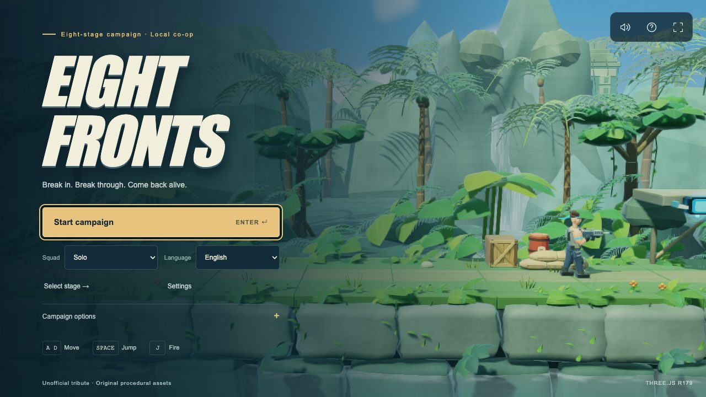

向 8 位横版射击经典致敬的非官方 Three.js 作品：八关战役、本地双人合作、现代／复古两套操作。所有资产程序化原创生成，运行资源全部内嵌，页面没有任何 CDN 请求——单个 HTML 文件，完全离线。

- **三种关卡形态**——横向卷轴战线、纵深推进的基地房间、垂直攀登的瀑布。
- **八个关底 Boss**，核心有暴露／封闭阶段，目标旁的标记直接告诉你此刻能打什么。
- **五种武器**（步枪、机枪、散射、激光、火焰）加手雷；拾取后保留一把备用枪。
- **本地合作**：一套键盘或两个手柄；无友伤，倒下的玩家在下一条命时重新加入。
- **现代或复古规则**——鼠标瞄准、长按连射、短按小跳；或固定跳高、八向瞄准、点按射击。
- **战斗内引导**——基地房间与 Boss 的情境提示，可切换为常显或关闭。
- **界面支持 English、简体中文、日本語**，主菜单即可切换。
- 基于 Three.js r179 的原创前向 HDR 管线：GPU 蒙皮士兵、SSAO、感知阴影的雾、泛光；三档画质预设。

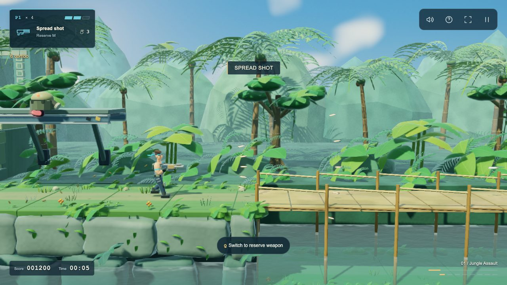

## 八条战线

| | 关卡 | 形态 | Boss | 说明 |
|---|---|---|---|---|
| 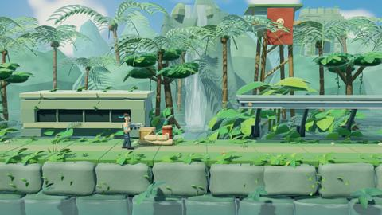 | **01 丛林突入** | 横向卷轴 | Super Wall | 打穿围墙，找到入口。会塌落的桥、树上平台、首批武器补给。 |
| 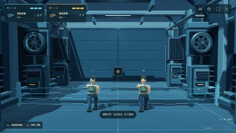 | **02 第一基地** | 纵深 · 5 室 | Ocular Defense | 摧毁感应器，穿过电网。横移对列；站、趴、跳改变枪线。 |
| 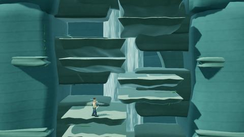 | **03 瀑布攀登** | 垂直 | Waterfall Guardian | 在滚落的巨石中攀登 24 层岩台；先打断守卫的双臂，核心才会开启。 |
| 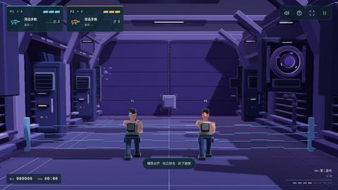 | **04 第二基地** | 纵深 · 8 室 | Illusion Core | 装甲感应器、贴地滚轮、投弹兵。站射击碎装甲，再趴射或跳射毁核心。 |
| 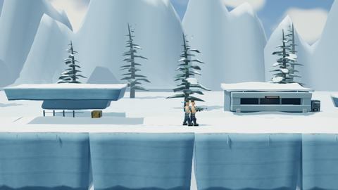 | **05 雪原突破** | 横向卷轴 | Armored UFO | 越过地雷与坦克把守的冰原；打掉运输舰的引擎会改变它的航线。 |
| 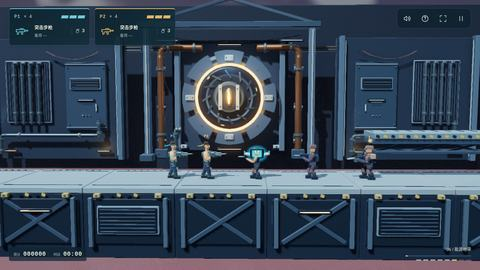 | **06 能源地带** | 横向卷轴 | Giant Soldier | 读懂火焰喷口的周期。Boss 有蓄力、冲撞、跃击三段前摇，蓄力时核心可攻击。 |
| 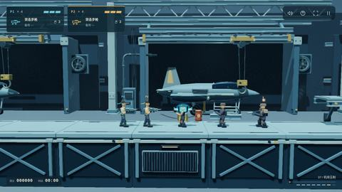 | **07 机库压制** | 横向卷轴 | Armored Gate | 在移动平台上躲过压机与矿车，再击破闸门的锁点。 |
| 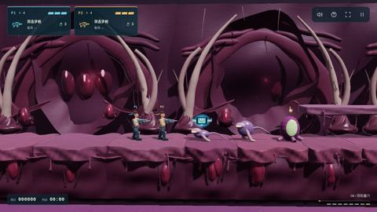 | **08 异形巢穴** | 横向卷轴 | Alien Heart | 摧毁孵化荚与喷酸的头颅；打爆孢囊后心脏才会暴露。 |

任何关卡都可以从选关面板直接练习，不会覆盖战役存档。战役进度、武器与生命在关卡之间继承，并保存在浏览器本地。

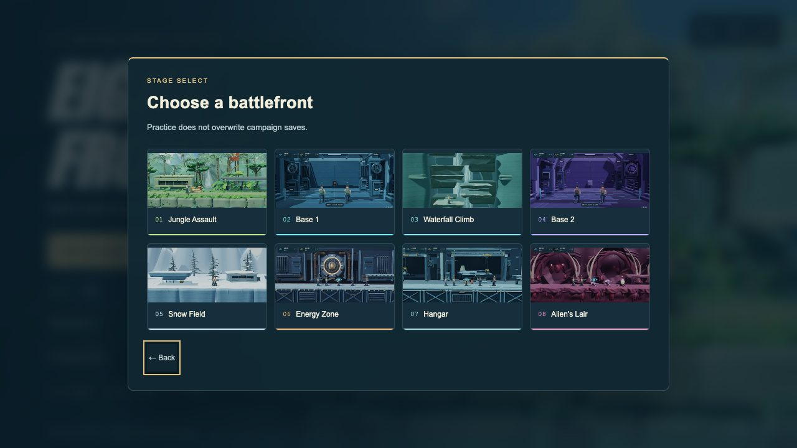

## 运行

```bash
npm run build
```

生成 `vendor/three.bundle.js` 与 `dist/index.html`（均为生成物，不入库）。桌面浏览器直接打开 `dist/index.html`，或执行 `npm run serve` 后打开终端显示的本机地址。需要 Node.js 20 或更新版本，不需要安装 npm 依赖。主菜单的 **保存离线版** 按钮可以在游戏内直接导出同一份单文件构建。

仅支持桌面：键盘、鼠标或手柄。纯触屏设备会显示提示而不是进入游戏。

## 操作

| 动作 | P1 | P2 | 手柄 |
|---|---|---|---|
| 移动／瞄准／蹲下 | W A S D | 方向键 | 十字键或左摇杆 |
| 射击 | J 或鼠标左键 | /（小键盘 1） | X 或 RT |
| 跳跃 | SPACE 或 K | .（小键盘 2） | A |
| 换枪 | Q | ,（小键盘 0） | Y |
| 手雷 | E 或 G | '（小键盘 3） | RB |
| 原地瞄准 | 左 SHIFT | 右 SHIFT | LB |
| 暂停 | ESC | ESC | Start |

单人时也可以用方向键、Z（射击）、X（跳跃）。↓ + 跳跃穿过单向平台。现代规则下 P1 可用鼠标或右摇杆瞄准；复古规则关闭自由瞄准。

基地普通房间需要横移对列；低位目标先松开移动和 SHIFT，再按下键趴射；高位目标需跳射。鼠标不代替基地姿态切换。核心全毁后向前进入下一室。

## 选项

- **小队**——单人或本地双人。**语言**——English、简体中文、日本語。
- **战役选项**——现代／复古操作；街机（三格护甲，复活点回满）／经典（一击倒地）难度。
- **设置**——画质预设（流畅／高画质／电影级）、渲染清晰度 50–125 %、减弱震屏与闪光、引导级别（情境／加强／关闭）、重置已掌握的操作。
- **诊断**——F3 帧率统计，F8 隐藏界面，可导出原始帧时间 JSON。

## 项目结构

由 `scripts/build.mjs` 拼接的纯浏览器脚本；没有打包器或框架。

| 文件 | 作用 |
|---|---|
| `src/shell.html` | 菜单、HUD、对话框的标记与 CSS |
| `src/app.js` | 输入、菜单、设置、存档、HUD 同步 |
| `src/game.js` | 模拟：玩家、敌人、Boss、房间、复活点 |
| `src/stages.js` | 八关定义、基地房间遭遇、武器 |
| `src/guidance.js`、`src/guidance-ui.js` | 目标状态模型与屏幕提示 |
| `src/i18n.js` | en / zh / ja 界面文案 |
| `src/renderer-three.js`、`src/shaders.js` | 基于 Three.js r179 的前向 HDR 管线 |
| `src/characters.js`、`src/geometry.js`、`src/*-assets.js` | 程序化骨骼、网格与场景道具 |
| `src/stage-previews.js` | 内嵌的关卡缩略图（游戏自身画面的裁切） |

## 许可

代码以 Apache License 2.0 提供（见 [LICENSE](LICENSE)），再分发时须随附 LICENSE 与 [NOTICE.md](NOTICE.md)。内嵌的 Three.js r179 遵循其自带 MIT 许可，全文在 `vendor/THREE-LICENSE.txt`，再分发时须随附。本项目是非官方致敬作品，与 Konami 无关；商标与资产来源声明见 [NOTICE.md](NOTICE.md)。
